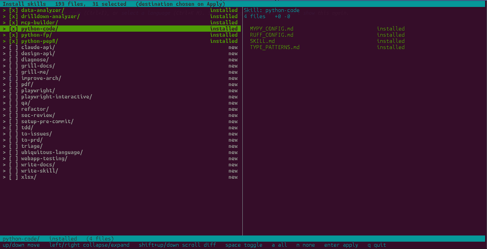

## claude-skills

[](https://github.com/wachawo/claude-skills/actions/workflows/ci.yml)
[](https://codecov.io/gh/wachawo/claude-skills?branch=main)
[](https://pypi.org/project/claude-skills/)
[](https://pypi.org/project/claude-skills/)
[](https://github.com/wachawo/claude-skills/blob/main/LICENSE)
[](https://pypi.org/project/claude-skills/)

[English](../README.md) | **[Русский](README_RU.md)**

Claude Skills для инженеров и разработчиков любого стека — готовая коллекция практичных скиллов, которые превращают Claude в сильного технического напарника.

В этом репозитории собраны скиллы для повседневной инженерной работы: **разработка**, **Python-тулинг**, **архитектура**, **DevOps**, **ревью кода**, **отладка**, **безопасность**, **browser-автоматизация**, **анализ данных** и **продуктивная работа с проектами**. Выберите нужные скиллы и установите их локально для проекта или глобально для всей машины за пару команд.

Каждый скилл — это не просто промпт, а рабочий инструмент, который помогает Claude лучше понимать задачи разработчика, писать чище код, быстрее разбираться в проектах и увереннее помогать в инженерных решениях.

Нашли сильный скилл или достойный репозиторий? Не стесняйтесь добавлять его в эту коллекцию через Pull Request — вместе соберём лучший набор Claude Skills для реальной разработки.



### Установка

#### 1. Из PyPI

```bash
pip install claude-skills
claude-skills
```

В пакете уже лежит каталог скиллов. Консольная команда `claude-skills`
открывает picker; LOCAL-цель резолвится относительно текущей рабочей
директории (`./.claude/skills/`).

`pipx` работает так же:

```bash
pipx install claude-skills
claude-skills
```

#### 2. Из исходников (`git clone`)

```bash
git clone https://github.com/wachawo/claude-skills.git
cd claude-skills
pip install -e .
claude-skills
```

Или совсем без установки — в корне репозитория есть тонкая обёртка:

```bash
git clone https://github.com/wachawo/claude-skills.git
cd claude-skills
python3 claude-skills.py
```

#### Требования

- Python ≥ 3.10 (современные type hints, f-strings).
- Настоящий терминал — `curses`, поэтому только SSH / интерактивный shell.
- Никаких сторонних зависимостей — установщик использует только стандартную
  библиотеку (`curses`, `pathlib`, `hashlib`, `difflib`, `shutil`).

Подробнее про клавиши, флаги `--user` / `--local` и удаление —
в [INSTALL.md](../INSTALL.md).

### Быстрый старт

```bash
claude-skills              # интерактивный picker, при Apply спрашивает USER vs LOCAL
claude-skills --user       # сразу в ~/.claude/skills
claude-skills --local      # сразу в ./.claude/skills
```

Клавиши picker'а:

| Клавиша | Действие |
|---|---|
| `Tab` | Переключить фокус между списком скиллов (слева) и панелью diff'а (справа) |
| `↑` / `↓` | Фокус слева — перемещение курсора. Фокус справа — прокрутка diff'а на строку. |
| `PgUp` / `PgDn` | То же по фокусу, шаг страницей |
| `Home` / `End` | То же по фокусу, в начало / в конец |
| `←` / `→` | Свернуть / развернуть скилл (только при фокусе слева) |
| `Shift+↑` / `Shift+↓` | Прокрутка diff'а (работает при любом фокусе) |
| `space` | Переключить выбор всего скилла — выбор только по-скилльно, не по-файлово |
| `a` / `n` | Выбрать всё / снять всё |
| `enter` | Применить (потом выбрать USER или LOCAL) |
| `q` | Выйти без изменений |

Уже установленные скиллы выводятся в начале списка. Статус определяется
проверкой сначала `./.claude/skills/<skill>/SKILL.md`, потом
`~/.claude/skills/<skill>/SKILL.md`:

- `new` — файл есть в каталоге, но не установлен.
- `installed` — файл байт-в-байт совпадает с установленной копией.
- `updated +X -Y` — установленная копия расходится с каталогом.

При Apply в USER, если такой же файл уже лежит в LOCAL, — LOCAL-копия
удаляется после записи USER-копии (одностороннее перемещение LOCAL → USER).
В обратную сторону автоматическое удаление никогда не происходит.

Снять галку с уже установленного скилла — все его файлы будут помечены на
удаление при Apply (отовсюду, где найдены). Выбор только на уровне скилла —
разворачивание списка нужно для просмотра diff по файлам, не для индивидуального
выбора. Пустые директории скиллов чистятся.

### Состав репозитория

| Файл / папка | Назначение |
|---|---|
| `claude-skills` (console script) | curses-инсталлер: двухпанельный picker, MD5-статусы `installed` / `updated +X -Y` / `new`, перемещение LOCAL → USER при Apply. |
| `src/claude_skills/cli.py` | Реализация инсталлера. |
| `skills/<name>/SKILL.md` (+ ресурсы) | Сами скиллы — по папке на скилл, подхватываются Claude Code. |
| `claude-skills.py` (в корне) | Тонкая обёртка, чтобы `python3 claude-skills.py` работал из свежего clone без `pip install`. |
| `INSTALL.md` | Подробный гайд по установке, клавишам, флагам, перемещению/удалению. |
| `tests/` | Набор pytest — 27 тестов на чистые функции (`truncate`, `aggregate_skill`, `build_rows`, `wrap_lines`) и работу с ФС (`md5_file`, `find_installed`, `assess`, `cleanup_empty_dirs`). Запускается через `pip install -e ".[dev]" && pytest`. |
| `.github/workflows/publish.yml` | На push тэга `vX.Y.Z`: собирает sdist + wheel и публикует в PyPI через trusted publishing (OIDC). |
| `.github/workflows/ci.yml` | На каждый push / PR: валидирует структуру скиллов, прогоняет pytest с покрытием, заливает в Codecov, собирает пакет. |

### Релиз

```bash
git tag v0.0.1
git push --tags
```

Workflow `publish` запустится по тэгу: соберёт sdist + wheel через
`python -m build`, прогонит `twine check`, опубликует в PyPI. PyPI один раз
надо сконфигурировать через
[trusted publishing](https://docs.pypi.org/trusted-publishers/) (после этого
API-токен не нужен).

---

### Каталог скиллов

#### [/diagnose](../skills/diagnose/SKILL.md) — 9.5

Дисциплинированный цикл отладки: воспроизвести → минимизировать → гипотеза → инструментировать → исправить → закрыть регрессионным тестом. Не даёт прыгать сразу к «фиксу» и закрывает баг тестом, чтобы он не вернулся. Применим к любому языку и стеку — ежедневный инструмент при работе с багами и регрессиями производительности.

#### [/qa](../skills/qa/SKILL.md) — 9.5

Интерактивная QA-сессия: пользователь жалуется в свободной форме, агент уточняет, в фоне исследует кодовую базу для доменного языка и заводит долговечные GitHub-issue через `gh`. Умеет разбивать составную проблему на несколько issue с корректными `Blocked by`. Лучший способ превратить «у меня тут не работает» в нормальный тикет.

#### [/drilldown-analyzer](../skills/drilldown-analyzer/SKILL.md) — 9.5

Систематическое расследование изменений метрик и аномалий: валидация изменения через z-score → таймлайн → декомпозиция метрики → drill-down по измерениям → **явные гипотезы с принятием/отклонением по доказательствам** → отчёт RCA. Включает скрипт `drilldown_analyzer.py`, [`references/hypothesis_testing_guide.md`](../skills/drilldown-analyzer/references/hypothesis_testing_guide.md), шаблон отчёта. Из репозитория `nimrodfisher/data-analytics-skills`.

#### [/data-analyzer](../skills/data-analyzer/SKILL.md) — 9.0

Глубокое погружение в датасет: профиль пропусков, выбросы (IQR + z-score), распределения, корреляции (флагирует `|r| > 0.8` как мультиколлинеарность). Скрипты `data_overview.py`, `null_profiler.py`, `outlier_detector.py`, `distribution_summary.py`, `correlation_explorer.py`, чек-лист и шаблон отчёта. Идеально как первый шаг перед [`/drilldown-analyzer`](../skills/drilldown-analyzer/SKILL.md). Из того же репозитория.

#### [/tdd](../skills/tdd/SKILL.md) — 9.0

Классический red-green-refactor с упором на интеграционные тесты и правильное мокание. В комплекте отдельные файлы про [deep modules](../skills/tdd/deep-modules.md), [interface design](../skills/tdd/interface-design.md), [refactoring](../skills/tdd/refactoring.md). Полезен и для новых фич, и для багов: тест сначала воспроизводит проблему, потом фиксится. Хорошо ложится на любой стек, включая Flask.

#### [/refactor](../skills/refactor/SKILL.md) — 9.0

Интервью с пользователем превращается в RFC-план рефакторинга, разбитый на крошечные безопасные коммиты, с оформлением в виде GitHub-issue. Защищает от «большого переписывания» и делает прогресс видимым. Связка с [`/to-issues`](../skills/to-issues/SKILL.md) и [`/triage`](../skills/triage/SKILL.md).

#### [/improve-arch](../skills/improve-arch/SKILL.md) — 9.0

Поиск возможностей углубить модули, опираясь на `CONTEXT.md` и ADR в `docs/adr/`. Ориентирован на DDD-подход и улучшение тестируемости/навигации. Рядом лежат [`DEEPENING.md`](../skills/improve-arch/DEEPENING.md), [`INTERFACE-DESIGN.md`](../skills/improve-arch/INTERFACE-DESIGN.md), [`LANGUAGE.md`](../skills/improve-arch/LANGUAGE.md) — методологическая база, а не просто промпт.

#### [/claude-api](../skills/claude-api/SKILL.md) — 9.0

Разработка и оптимизация приложений на Anthropic SDK: prompt caching, thinking, tool use, batch, миграции между версиями моделей. Поддержаны Python/TS/Go/Java/Ruby/PHP/C#/curl. Если пишешь что-то на Claude API — обязательный.

#### [/python-code](../skills/python-code/SKILL.md) — 9.0

Подробный гайд по качеству Python-кода: Ruff (lint + format), MyPy (strict-режим), type hints на современном синтаксисе (`list[str]`, `int | None`, Generic, Callable, Protocol), антипаттерны (mutable defaults, bare except), питонячие идиомы, организация модулей с `py.typed`. В комплекте [`RUFF_CONFIG.md`](../skills/python-code/RUFF_CONFIG.md), [`MYPY_CONFIG.md`](../skills/python-code/MYPY_CONFIG.md), [`TYPE_PATTERNS.md`](../skills/python-code/TYPE_PATTERNS.md) и финальный чек-лист. Из репозитория `wdm0006/python-skills` по гайду mcginniscommawill.com.

#### [/python-fp](../skills/python-fp/SKILL.md) — 8.5

Гайд по функциональному стилю в Python: чистые функции, иммутабельность (`NamedTuple`, dict-factory, `MappingProxyType`), HOFs, замыкания и каррирование, `functools` (`lru_cache`, `partial`, `reduce`, `singledispatch`), `itertools` (`groupby`, `accumulate`, `pairwise`), `operator` вместо лямбд, композиция, типизация через `Callable`/`ParamSpec`/`Protocol`, антипаттерны и архитектурный паттерн **immutable core — mutable shell**. Лежит ровно на правиле CLAUDE.md «функциональный стиль вместо классов».

#### [/python-pep8](../skills/python-pep8/SKILL.md) — 8.5

Подробный гайд по [PEP 8](https://peps.python.org/pep-0008/) с do/don't примерами для каждого правила: раскладка (отступы, длина строки, пустые строки, перенос на бинарных операторах), импорты, именование (snake_case / PascalCase / UPPER_CASE), пробелы (включая нюанс `=` в kwargs vs аннотированных дефолтах), комментарии и docstrings, программные рекомендации (`is None`, `isinstance`, `startswith`, `"".join`, конкретные except). Финальный чек-лист + конфиг `ruff` для автоматизации.

#### [/write-skill](../skills/write-skill/SKILL.md) — 9.0

Метаскилл: создаёт новые скиллы с правильной структурой, прогрессивным раскрытием и встроенными ресурсами. Нужен, как только хочется унести повторяющийся промпт в `skills/`.

#### [/grill-me](../skills/grill-me/SKILL.md) — 8.5

Безжалостно допрашивает по плану/дизайну, пока не разрешена каждая ветка дерева решений. Хорошо вылавливает дыры до того, как они станут кодом. Подходит для предварительной проверки архитектурных решений.

#### [/to-issues](../skills/to-issues/SKILL.md) — 8.5

Превращает план/PRD/спецификацию в независимо разбираемые тикеты по принципу «трассирующих пуль» (вертикальные срезы). Обеспечивает параллелизм и видимость прогресса.

#### [/triage](../skills/triage/SKILL.md) — 8.5

Конечный автомат для сортировки issue с ролями триажа: создание, разбор багов/фич, подготовка задач для AFK-агента. В паре с [`AGENT-BRIEF.md`](../skills/triage/AGENT-BRIEF.md) и [`OUT-OF-SCOPE.md`](../skills/triage/OUT-OF-SCOPE.md) даёт устойчивый рабочий процесс.

#### [/mcp-builder](../skills/mcp-builder/SKILL.md) — 8.5

Гид по созданию качественных MCP-серверов (FastMCP / Node SDK) с упором на дизайн инструментов. Нужен, если интегрируешь внешние сервисы для LLM.

#### [/grill-docs](../skills/grill-docs/SKILL.md) — 8.0

Та же «грилка», но синхронизирует план с [`CONTEXT-FORMAT.md`](../skills/grill-docs/CONTEXT-FORMAT.md) и [`ADR-FORMAT.md`](../skills/grill-docs/ADR-FORMAT.md): оттачивает терминологию и обновляет документацию по мере кристаллизации решений. Полезно в проектах с зафиксированной доменной моделью.

#### [/to-prd](../skills/to-prd/SKILL.md) — 8.0

Превращает текущий контекст разговора в PRD и публикует в трекер. Удобно, когда обсуждение фичи уже состоялось и его надо «сохранить».

#### [/ubiquitous-language](../skills/ubiquitous-language/SKILL.md) — 8.0

Извлекает DDD-глоссарий из разговора, помечает неоднозначности и предлагает канонические термины, сохраняя в `UBIQUITOUS_LANGUAGE.md`. База для [`/grill-docs`](../skills/grill-docs/SKILL.md) и [`/improve-arch`](../skills/improve-arch/SKILL.md).

#### [/write-docs](../skills/write-docs/SKILL.md) — 8.0

Структурированный воркфлоу для написания документации, спеков, decision-doc'ов с итеративной проработкой и проверкой «работает ли это для читателя». Лучше, чем просить LLM «напиши доку».

#### [/review-security](../skills/review-security/SKILL.md) — 8.0

Security review для Python/JS/TS/Go с конкретными улучшениями. Запускается явно — не для общего ревью, а именно для секьюрити-прохода. Результат пишется в `REVIEW-SECURITY.md`.

#### [/webapp-testing](../skills/webapp-testing/SKILL.md) — 8.0

Playwright-тулкит для тестирования локальных веб-приложений: проверка фронта, дебаг UI, скриншоты, логи. Хорошо ложится на Vue/SPA-стек.

#### [/playwright](../skills/playwright/SKILL.md) — 8.0

Автоматизация браузера из терминала через `playwright-cli`: навигация, заполнение форм, скриншоты, экстракция данных. Базовый инструмент для всего, что про реальный браузер.

#### [/design-api](../skills/design-api/SKILL.md) — 7.5

Генерирует несколько радикально разных вариантов API/интерфейса модуля параллельными подагентами. Хорошо для «design it twice» — когда нужно сравнить формы, а не закоммититься в первую идею.

#### [/playwright-interactive](../skills/playwright-interactive/SKILL.md) — 7.5

Постоянная браузерная сессия (включая Electron) через `js_repl` для быстрых итераций при дебаге UI. Узкая ниша, но в ней ничего лучше нет.

#### [/setup-pre-commit](../skills/setup-pre-commit/SKILL.md) — 7.5

Husky + lint-staged + Prettier + типы + тесты на pre-commit. Запускается один раз на проекте, потом не нужен. Полезно, но разово.

#### [/xlsx](../skills/xlsx/SKILL.md) — 7.5

Чтение/правка/создание `.xlsx`/`.csv`/`.tsv`: формулы, форматирование, графики, очистка мусорных таблиц. Если работаешь с табличками — must have, иначе не нужен.

#### [/pdf](../skills/pdf/SKILL.md) — 7.5

Полный набор для PDF: чтение, мердж, сплит, формы, водяные знаки, OCR. Узкая, но мощная утилита под конкретный формат.

#### [/ui-ux-pro-max](../skills/ui-ux-pro-max/SKILL.md) — 8.5

UI/UX-design intelligence для веба и мобайла: 50+ стилей, 161 цветовая палитра, 57 шрифтовых пар, 99 UX-гайдлайнов, 25 типов графиков — на 10 стеках (React, Next.js, Vue, Svelte, SwiftUI, React Native, Flutter, Tailwind, shadcn/ui, чистый HTML/CSS). Зонтичный скилл, оркестрирует остальные из набора. Из репозитория [`nextlevelbuilder/ui-ux-pro-max-skill`](https://github.com/nextlevelbuilder/ui-ux-pro-max-skill).

#### [/design](../skills/design/SKILL.md) — 8.0

Сводный design-скилл: бренд-идентика, design tokens, генерация логотипов (55 стилей через Gemini), corporate identity program (50 артефактов, CIP-мокапы), HTML-презентации с Chart.js, баннеры (22 стиля), иконки (15 стилей, SVG), social photos. Производство визуала под ключ. Из того же репо.

#### [/ui-styling](../skills/ui-styling/SKILL.md) — 8.0

shadcn/ui + Tailwind utility-first: доступные компоненты (диалоги, dropdown'ы, формы, таблицы), темы/dark-mode, адаптивные раскладки, canvas-визуал. Тяжёлая папка `canvas-fonts/` (54 ttf, 5.5 МБ) при импорте удалена — донесите шрифты сами, если нужен canvas-рендер. Из того же репо.

#### [/design-system](../skills/design-system/SKILL.md) — 7.5

Трёхслойная token-архитектура (primitive → semantic → component): CSS-переменные, шкалы spacing/typography, спеки компонентов, brand-совместимая генерация слайдов. Для системного, token-driven дизайна. Из того же репо.

#### [/brand](../skills/brand/SKILL.md) — 7.5

Brand voice, визуальная идентика, messaging-фреймворки, управление ассетами, контроль консистентности. Подходит для брендированного контента, tone-of-voice, маркетинговых ассетов, проверки на соответствие style guide. Из того же репо.

#### [/banner-design](../skills/banner-design/SKILL.md) — 7.5

Баннеры для Facebook/Twitter/LinkedIn/YouTube/Instagram/Google Display, hero-секций сайтов, печати. Разные art-direction варианты (minimalist, gradient, glassmorphism, 3D, neon, duotone, editorial и др.). Из того же репо.

#### [/slides](../skills/slides/SKILL.md) — 7.5

Стратегические HTML-презентации с Chart.js, design tokens, адаптивными раскладками, copywriting-формулами, контекстными slide-стратегиями. Из того же репо.
